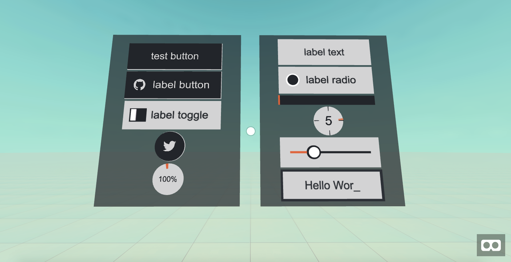

# aframe-gui

A graphical User Interface framework for [A-Frame](https://aframe.io).




The `aframe-gui` components provide layout and gui widgets that can be used
to create a user interface in an A-Frame scene. 

The `dist/aframe-gui.js` file defines the following components:

| Component             | Primitive                | Description |
| --------------------  | ------------------------ | -------------------------------------------------------  |
| gui-flex-container    | a-gui-flex-container     | Layout container with flexbox-inspired                   |
| gui-item              | <none>                   | Used by other components for common properties like height and width    |
| gui-interactable      | <none>                   | Used by other components to define onclick behavior      |
| gui-cursor            | a-gui-cursor             | Cursor used to interact with GUI elements.               |
| gui-button            | a-gui-button             | Standard button component with text label                |
| gui-icon-button       | a-gui-icon-button        | Button with icon label instead of text                   |
| gui-icon-label-button | a-gui-icon-label-button  | Button with both icon and text labels                    |
| gui-radio             | a-gui-radio              | Radio button                                             |
| gui-toggle            | a-gui-toggle             | Toggle button                                            |
| gui-slider            | a-gui-slider             | Slider component                                         |
| gui-vertical-slider   | a-gui-slider             | Vertical slider component                                |
| gui-input             | a-gui-input              | Text input field                                         |
| gui-label             | a-gui-label              | Text label                                               |
| gui-progress-bar      | a-gui-progress-bar       | Progress bar                                             |
| gui-circle-loader     | a-gui-circle-loader      | Circular progress meter                                  |
| gui-circle-timer      | a-gui-circle-timer       | Circular progress meter with timer                       |


## Examples

Examples are available at:

[https://rdub80.github.io/aframe-gui/examples/index.html](https://rdub80.github.io/aframe-gui/examples/index.html)
 

## Use in your AFrame project

Include the following Javascript in the head of the page containing your AFrame scene:

`https://rawgit.com/rdub80/aframe-gui/master/dist/aframe-gui.min.js
`
## Building

Run the following to build to the examples/js folder:

`npm run dist-example`

`npm run dist-example-min`

## Run locally

Run the following start the webpack-dev-server:

`npm start`

The webpack-dev-server should now be running at http://localhost:8080


## Components


### a-gui-flex-container Component

#### Properties

| Property         | Description                                            | Default Value |
| --------         | ----------------------------------------------------   | ------------- |
| flex-direction   | property specifies how flex items are placed in the flex container defining the main axis and the direction  | 'row'         |
| justify-content  | property defines distributed space between and around content items along the main axis of their container   | 'flexStart'   |
| align-items      | roperty defines distributed space between and around flex items along the cross-axis of their container. Like justify-content but in the perpendicular direction. | 'flexStart'   |
| item-padding     | Padding between items                                                                                        | 0.0           |
| opacity          | Transparency of the flex-conntainer                                                                          | 0.0           |
| is-top-container | Setting background of the flex-container                                                                     | false         |
| panel-color      | Background color of the flex-container                                                                       | #22252a       |


```html
<a-gui-flex-container 
	flex-direction="column" justify-content="center" align-items="normal" component-padding="0.1" opacity="0.7" width="3.5" height="4.5"
	position="2 2.5 -4" rotation="0 0 0"
>
... gui items here...
</a-gui-flex-container>
```


### a-gui-cursor Component


#### Properties

| Property    | Description                                               | Default Value |
| --------    | -------------------------------------------------------   | ------------- |
| color       | Cursor initial color                                      | #ffffff       |
| hover-color | Cursor hover color                                        | #ffffff       |
| active-color| Cursor selection/active color                             | #ed5b21       |
| distance    | distance of the pointer from the camera                   | -1            |
| design      | choose a design: 'dot', 'ring', 'cross' or 'reticle'      | 'dot'         |


```html
		<!-- Camera + cursor. -->
		<a-entity id="cameraRig" position="0 1.6 0">
			<a-camera look-controls wasd-controls position="0 0 0">
				<a-gui-cursor id="cursor"
						  raycaster="objects: [gui-interactable]"
						  fuse="true" fuse-timeout="2000"
						  design="ring"
				>
				</a-gui-cursor> <!-- /cursor -->
			</a-camera> <!-- /camera -->
		</a-entity>
```

#### Example without fuse/gaze trigger (click trigger):


```html
		<!-- Camera + cursor. -->
		<a-entity id="cameraRig" position="0 1.6 0">
			<a-camera look-controls wasd-controls position="0 0 0">
				<a-gui-cursor id="cursor"
						  raycaster="objects: [gui-interactable]"
						  fuse="false"
				>
				</a-gui-cursor> <!-- /cursor -->
			</a-camera> <!-- /camera -->
		</a-entity>
```


### a-gui-button Component

        
#### Properties

| Property           | Description                                               | Default Value |
| --------           | -------------------------------------------------------   | ------------- |
| active-color       | Background color when button is pressed down              | #ed5b21       |
| background-color   | Background color of button                                | #22252a       |
| border-color       | Border color of button                                    | #d3d3d4       |
| font-color         | Text color for button label                               | #d3d3d4       |
| font-family        | Font family for button                                    | 'Arial'       |
| font-size          | Font size for button                                      | '150px'       |
| font-weight        | Font weight for button                                    | 'normal'      |
| height             | Height of item                                            | 1             |
| hover-color        | Background color when button is in hover state            | #2c3037       |
| key-code           | Key shortcut to trigger onclick action                    |               |
| on                 | Event that triggers onclick action                        | click         |
| onclick            | Javascript function to execute on click                   |               |
| onhover            | Javascript function to execute on click                   |               |
| toggle             | If true, button acts as toggle button with on/off state   | false         |
| toggle             | Current on/off state of toggle button                     | false         |
| value              | Text of button label                                      |               |
| height             | Height of item                                            | 1             |
| width              | Width of item                                             | 1             |
| margin             | Margin around item                                        | 0 0 0 0       |


```html
	<a-gui-button 
		width="2.5" height="0.75"
		onclick="buttonActionFunction" key-code="32"
		value="test button"
		font-family="Arial"
		margin="0 0 0.05 0"
	>
	</a-gui-button>
```


### a-gui-circle-loader Component


#### Properties

| Property           | Description                                               | Default Value |
| --------           | -------------------------------------------------------   | ------------- |
| active-color       | Color of ring that indicates loading progress             | #ed5b21       |
| background-color   | Background color of item                                  | #22252a       |
| count              | Initial percentage progress value                         | 0             |
| font-color         | Text color for progress percentage text                   | #d3d3d4       |
| font-family        | Font family for progress percentage text                  | 'Arial'       |
| font-size          | Font size for progress percentage text                    | '150px'       |
| height             | Height of item                                            | 1             |
| width              | Width of item                                             | 1             |
| margin             | Margin around item                                        | 0 0 0 0       |


```html
	<a-gui-circle-loader
		height="0.75"
		font-family="Arial"
	>
	</a-gui-circle-loader>
```


### a-gui-circle-timer Component

#### Properties

| Property           | Description                                               | Default Value |
| --------           | -------------------------------------------------------   | ------------- |
| active-color       | Color of ring that indicates countdown progress           | #ed5b21       |
| background-color   | Background color of item                                  | #22252a       |
| border-color       | Color of indicators that show 25/50/75/100 progress       | #22252a       |
| count-down         | Initial countdown value in seconds                        | 0             |
| callback           | callback function that fires when countdown expires       | ''            |
| font-color         | Text color for progress countdown text                    | #d3d3d4       |
| font-family        | Font family for progress countdown text                   | 'Arial'       |
| font-size          | Font size for countdown text                              | '150px'       |
| height             | Height of item                                            | 1             |
| width              | Width of item                                             | 1             |
| margin             | Margin around item                                        | 0 0 0 0       |

callback

```html
<a-gui-circle-timer 
	height="0.75"
	count-down="5"
	font-family="Arial"
	margin="0 0 0.05 0"
>
</a-gui-circle-timer>
```

### a-gui-icon-button Component

#### Properties

| Property           | Description                                               | Default Value |
| --------           | -------------------------------------------------------   | ------------- |
| on                 | Event that triggers onclick action                        | click         |
| icon               | 			                                                 | ''            |
| icon-active        | 			                                                 | ''            |
| icon-font-size     | Icon Font size for button                                 | '400px'       |
| toggle             | Toggle status                                             | false         |
| font-color         | Text color for button label                               | #d3d3d4       |
| border-color       | Border color of button                                    | #d3d3d4       |
| background-color   | Background color of item                                  | #22252a       |
| hover-color        | Background color when button is in hover state            | #2c3037       |
| active-color       | Background color when button is pressed down              | #ed5b21       |
| height             | Height of item                                            | 1             |
| width              | Width of item                                             | 1             |
| margin             | Margin around item                                        | 0 0 0 0       |


```html
<a-gui-icon-button
	height="0.75"
	onclick="buttonActionFunction"
	icon="social-twitter"
	margin="0 0 0.05 0"
>
</a-gui-icon-button>
```


### a-gui-icon-label-button Component

#### Properties

| Property         | Description                                            | Default Value |
| --------         | ----------------------------------------------------   | ------------- |
| on               | Event that triggers onclick action                     | click         |
| icon             |  			                                            | ''            |
| icon-active      |  			                                            | ''            |
| icon-font-size   | Icon Font size for button                              | '400px'       |
| text             |  			                                            | ''            |
| toggle           | Toggle status                                          | false         |
| font-family      | Font family for button                                 | 'Arial'       |
| font-size        | Font size for button                                   | '150px'       |
| font-color       | Text color for button label                            | #d3d3d4       |
| border-color     | Border color of button                                 | #d3d3d4       |
| background-color | Background color of button                             | #22252a       |
| hover-color      | Background color when button is in hover state         | #2c3037       |
| active-color     | Background color when button is pressed down           | #ed5b21       |
| height           | Height of button                                       | 1             |
| width            | Width of button                                        | 1             |
| margin           | Margin around button                                   | 0 0 0 0       |


```html
<a-gui-icon-label-button
	width="2.5" height="0.75"
	onclick="buttonActionFunction"
	icon="social-github"
	value="label button"
	font-family="Arial"
	margin="0 0 0.05 0"
>
</a-gui-icon-label-button>
```


### a-gui-input Component

#### Properties

| Property           | Description                                           | Default Value  |
| --------           | ----------------------------------------------------  | -------------  |
| background-color   | Background color of input                             | #22252a        |
| border-color       | Border color of input                                 | #2c3037        |
| border-hover-color | Border color when input is in hover state             | #22252a        |
| font-color         | Text input color                                      | #2c3037        |
| font-family        | Font family for input                                 | 'Arial'        |
| font-size          | Font size for input                                   | '150px'        |
| height             | Height of item                                        | 1              |
| hover-color        | Background color when input is in hover state         | #2c3037        |
| margin             | Margin around item                                    | 0 0 0 0        |
| onclick               | Function to call on click event                    |           |
| onhover               | Function to call on hover event                    |           |
| value        | Input text value                                           |   |
| width              | Width of item                                         | 1              |


```html
<a-gui-input id="test_input"
     width="4" height="0.7"
     onclick="testInputAction"
     value="Starting value"
     font-size="160px"
     font-color="#212121"
     border-color="#212121"
     border-hover-color="#424242"
     background-color="#FAFAFA"
     hover-color="#F5F5F5"
     active-color="#FFEB3B"
>
</a-gui-input>
```


### a-gui-label Component

#### Properties

| Property         | Description                                             | Default Value  |
| --------         | ------------------------------------------------------- | -------------  |
| text             |  			                                             | 'label text'   |
| label-for        |  			                                             | null           |
| font-family      | Font family for input                                   | 'Arial'        |
| font-size        | Font size for input                                     | '150px'        |
| font-color       | Text input color                                        | #2c3037        |
| font-weight      | Font weight for label                                   | 'normal'      |
| background-color | Background color of label                               | #d3d3d4        |
| opacity          | Transparency of the label                               | 1.0           |
| height           | Height of item                                          | 1              |
| width            | Width of item                                           | 1              |
| margin           | Margin around item                                      | 0 0 0 0        |


```html
<a-gui-label 
	width="2.5" height="0.75"
	value="label text"
	font-family="Arial"
	margin="0 0 0.05 0"
>
</a-gui-label>
```


### a-gui-progress-bar Component

#### Properties

| Property         | Description                                               | Default Value |
| --------         | -------------------------------------------------------   | ------------- |
| background-color | Background color of progress bar                          | #22252a       |
| active-color     | Color for indicating progress level                       | #ed5b21       |
| height           | Height of item                                            | 1             |
| width            | Width of item                                             | 1             |
| margin           | Margin around item                                        | 0 0 0 0       |


```html
<a-gui-progressbar 
	width="2.5" height="0.25"
	margin="0 0 0.05 0"
>
</a-gui-progressbar>
```


### a-gui-radio Component

#### Properties

| Property         | Description                                               | Default Value  |
| --------         | -------------------------------------------------------   | -------------  |
| on               | Event that triggers onclick action                        | click          |
| text             |                                                           | 'text'         |
| active           |                                                           | true           |
| checked          |                                                           | false          |
| font-family      | Font family for radio                                     | 'Arial'        |
| font-size        | Font size for radio                                       | '150px'        |
| font-color       | Text radio color                                          | #2c3037        |
| border-color     | Border color of input                                     | #ffffff        |
| background-color | Background color of radio                                 | #d3d3d4        |
| hover-color      |                                                           | #606876        |
| active-color     |                                                           | #ed5b21        |
| handle-color     |                                                           | #22252a        |
| height           | Height of item                                            | 1              |
| width            | Width of item                                             | 1              |
| margin           | Margin around item                                        | 0 0 0 0        |


```html
<a-gui-radio 
	width="2.5" height="0.75"
	onclick="toggleActionFunction"
	value="label radio"
	font-family="Arial"
	margin="0 0 0.05 0"
>
</a-gui-radio>
```


### a-gui-slider Component

#### Properties

| Property            | Description                                               | Default Value  |
| --------            | -------------------------------------------------------   | -------------  |
| active-color        |                                                           | #ed5b21        |
| background-color    |                                                           | #d3d3d4        |
| border-color        |                                                           | #22252a        |
| handle-color        |                                                           | #ffffff        |
| handle-outer-radius |                                                           | '0.17'         |
| handle-inner-radius |                                                           | '0.13'         |
| handle-outer-depth  |                                                           | '0.04'         |
| handle-inner-depth  |                                                           | '0.02'         |
| height              | Height of item                                            | 1              |
| hover-color         |                                                           | #606876        |
| left-right-padding  |                                                           | '0.25'         |
| margin              | Margin around item                                        | 0 0 0 0        |
| onclick             | Javascript function to execute on click                   |               |
| onhover             | Javascript function to execute on click                   |               |
| percent             |                                                           | '0.5'          |
| slider-bar-depth    |                                                           | '0.03'         |
| slider-bar-height   |                                                           | '0.05'         |
| top-bottom-padding  |                                                           | '0.125'        |
| width               | Width of item                                             | 1              |


```html
<a-gui-slider 	
	width="2.5" height="0.75"
	onclick="slideActionFunction"
	percent="0.29"
	margin="0 0 0.05 0"
>
</a-gui-slider>
```


### a-gui-toggle Component

#### Properties

| Property         | Description                                               | Default Value  |
| --------         | -------------------------------------------------------   | -------------  |
| on               | Event that triggers onclick action                        | click          |
| text             |                                                           | 'text'         |
| active           |                                                           | true           |
| checked          |                                                           | false          |
| border-width     |                                                           | 1              |
| font-family      |                                                           | 'Arial'        |
| font-size        |                                                           | '150px'        |
| font-color       |                                                           | #2c3037        |
| border-color     |                                                           | #22252a        |
| background-color |                                                           | #d3d3d4        |
| hover-color      |                                                           | #606876        |
| active-color     |                                                           | #ed5b21        |
| handle-color     |                                                           | #d3d3d4        |
| height           | Height of item                                            | 1              |
| width            | Width of item                                             | 1              |
| margin           | Margin around item                                        | 0 0 0 0        |


```html
<a-gui-toggle
	width="2.5" height="0.75"
	onclick="testToggleAction"
	value="label toggle"
	font-family="Arial"
	margin="0 0 0.05 0"
>
</a-gui-toggle>
```

### a-gui-vertical-slider Component

#### Properties

| Property            | Description                                               | Default Value  |
| --------            | -------------------------------------------------------   | -------------  |
| active-color        |                                                           | #ed5b21        |
| background-color    |                                                           | #d3d3d4        |
| border-color        |                                                           | #22252a        |
| handle-color        |                                                           | #ffffff        |
| handle-outer-radius |                                                           | 0.17         |
| handle-inner-radius |                                                           | 0.13         |
| handle-outer-depth  |                                                           | 0.04         |
| handle-inner-depth  |                                                           | 0.02         |
| height              | Height of item                                            | 1              |
| hover-color         |                                                           | #606876        |
| hover-font-size     | Font size of label indicating where user is hovering      | 180px        |
| hover-height         |  Height of label indicating where user is hovering       | 1.0        |
| hover-margin        |  Margin of label indicating where user is hovering        | 1.0       |
| hover-percent        | Current percentage where user is hovering                |         |
| hover-width        | Width of label indicating where user is hovering           | 1.0        |
| left-right-padding  |                                                           | 0.25         |
| margin              | Margin around item                                        | '0 0 0 0'        |
| onclick             | Javascript function to execute on click                   |               |
| onhover             | Javascript function to execute on click                   |               |
| opacity          | Transparency of the vertical slider background               | 1.0           |
| output-font-size         |  Font size of label indicating output value          | 180px        |
| output-function         |  Name of function to calculate output value from percent |         |
| output-height         |   Height of label indicating output value               | 1.0       |
| output-margin        |  Margin of label indicating output value                 | '0 0 0 0'       |
| output-width        |  Width of label indicating output value                   | 1.0        |
| percent             |  Current selected slider value, from 0.0 to 1.0           | 0.5         |
| slider-bar-depth    |                                                           | 0.03         |
| slider-bar-height   |                                                           | 0.05         |
| top-bottom-padding  |                                                           | 0.125        |
| width               | Width of item                                             | 1              |


```html
<a-gui-slider 	
	width="2.5" height="0.75"
	onclick="slideActionFunction"
	percent="0.29"
	margin="0 0 0.05 0"
>
</a-gui-slider>
```

